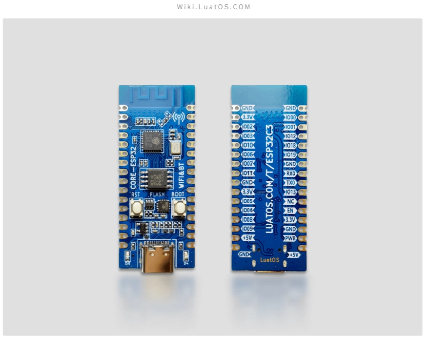
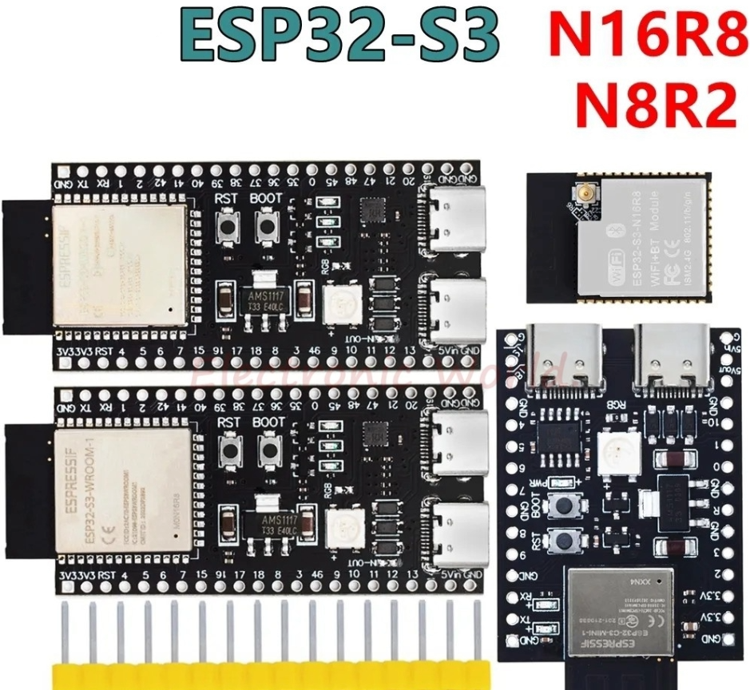
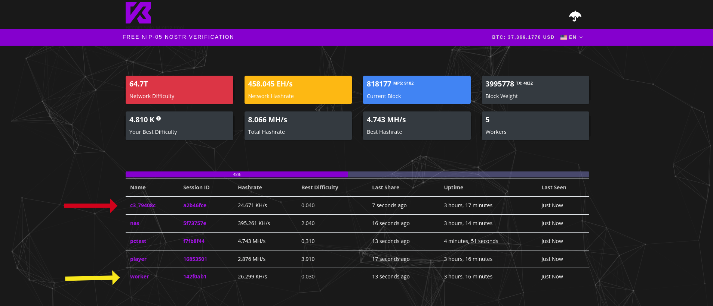
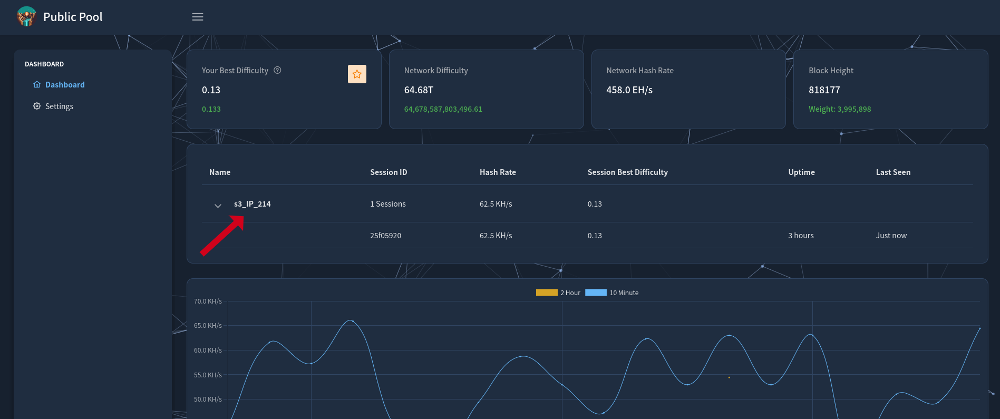
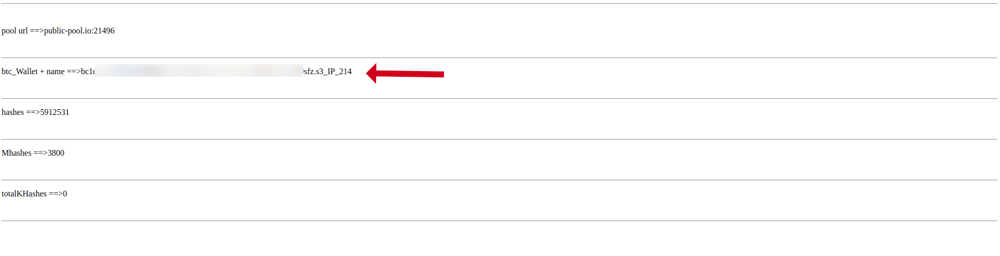

# NerdMiner_cost-down

引用 https://github.com/BitMaker-hub/NerdMiner_v2   開發的低成本的版本

雖很多人購買了帶屏的設備，但是運行過程中 99.9% 的人，是不會使用顯示屏的。
多白費錢購買無用的顯示屏，還不如買更便宜的運行版。

改使用下面的硬件版子：
1. 合宙 ESP32-C3 無屏版本
   https://wiki.luatos.com/chips/esp32c3/board.html

2. ESP32-S3 N8R2 無屏版本
3. EPS32-S3 N16R4 無屏版本 
4. EPS32-S3 其他無屏版本

**系統運行時，只需要 < 60kbytes ram 及  < 1Mbytes  的 flash 即可！**

預計新增：

- [x]   新增備源服務器 若是原服務器故障，自動連接備源服務器
- [x]   修改設備名稱，使用  C3 或 S3 + mac 後 3 碼，以利判定工作情況  (改成可自定義名稱 預設 esp_)
- [x]   修改設備名稱，使用  C3 或 S3 + IP 最後碼，以利判定工作情況 (改成可自定義名稱 預設 esp_)
- [x]   增加 web 接口，以利無需屏，可以直接查看運行狀態
- [x]   修改 LED 工作模式
- [x]  增加多個路由連接，以方便移動時用戶不用一直改來改去

自動連接備源模式

<table style="border-collapse: collapse; width: 98.4277%; height: 176px;" border="1"><tbody><tr style="  "><td style="text-align: center;" data-mce-style="text-align: center;"> </td><td style="text-align: center;" colspan="6" data-mce-style="text-align: center;">連接池 </td></tr><tr style="  "><td style="text-align: center;" data-mce-style="text-align: center;">工作模式</td><td style="text-align: center;" data-mce-style="text-align: center;">設置默認</td><td style="text-align: center;" data-mce-style="text-align: center;">vkbit</td><td style="text-align: center;" data-mce-style="text-align: center;">public-io</td><td style="text-align: center;" data-mce-style="text-align: center;">nerdminer</td><td style="text-align: center;" data-mce-style="text-align: center;">ckpool</td><td style="text-align: center;" data-mce-style="text-align: center;">zsolo</td></tr><tr style="  "><td style="text-align: center;" data-mce-style="text-align: center;">0</td><td style="text-align: center;" data-mce-style="text-align: center;">V</td><td style="text-align: center;" data-mce-style="text-align: center;"> </td><td style="text-align: center;" data-mce-style="text-align: center;"> </td><td style="text-align: center;" data-mce-style="text-align: center;"> </td><td style="text-align: center;" data-mce-style="text-align: center;"> </td><td style="text-align: center;" data-mce-style="text-align: center;"> </td></tr><tr style="  "><td style="text-align: center;" data-mce-style="text-align: center;">1</td><td style="text-align: center;" data-mce-style="text-align: center;">V</td><td style="text-align: center;" data-mce-style="text-align: center;">V</td><td style="text-align: center;" data-mce-style="text-align: center;"> </td><td style="text-align: center;" data-mce-style="text-align: center;"> </td><td style="text-align: center;" data-mce-style="text-align: center;"> </td><td style="text-align: center;" data-mce-style="text-align: center;"> </td></tr><tr style="  "><td style="text-align: center;" data-mce-style="text-align: center;">2</td><td style="text-align: center;" data-mce-style="text-align: center;">V</td><td style="text-align: center;" data-mce-style="text-align: center;">V</td><td style="text-align: center;" data-mce-style="text-align: center;">V</td><td style="text-align: center;" data-mce-style="text-align: center;"> </td><td style="text-align: center;" data-mce-style="text-align: center;"> </td><td style="text-align: center;" data-mce-style="text-align: center;"> </td></tr><tr style="  "><td style="text-align: center;" data-mce-style="text-align: center;">3</td><td style="text-align: center;" data-mce-style="text-align: center;">V</td><td style="text-align: center;" data-mce-style="text-align: center;">V</td><td style="text-align: center;" data-mce-style="text-align: center;">V</td><td style="text-align: center;" data-mce-style="text-align: center;">V</td><td style="text-align: center;" data-mce-style="text-align: center;"> </td><td style="text-align: center;" data-mce-style="text-align: center;"> </td></tr><tr style="  "><td style="text-align: center;" data-mce-style="text-align: center;">4</td><td style="text-align: center;" data-mce-style="text-align: center;">V</td><td style="text-align: center;" data-mce-style="text-align: center;">V</td><td style="text-align: center;" data-mce-style="text-align: center;">V</td><td style="text-align: center;" data-mce-style="text-align: center;">V</td><td style="text-align: center;" data-mce-style="text-align: center;">V</td><td style="text-align: center;" data-mce-style="text-align: center;"> </td></tr><tr style="  "><td style="text-align: center;" data-mce-style="text-align: center;">&gt;= 5</td><td style="text-align: center;" data-mce-style="text-align: center;">V</td><td style="text-align: center;" data-mce-style="text-align: center;">V</td><td style="text-align: center;" data-mce-style="text-align: center;">V</td><td style="text-align: center;" data-mce-style="text-align: center;">V</td><td style="text-align: center;" data-mce-style="text-align: center;">V</td><td style="text-align: center;" data-mce-style="text-align: center;">V</td></tr></tbody></table>  
    

黃色箭頭為原本顯示，無法知道是那一台設備

紅色箭頭為修改過之版，可以顯示該設備的 mac 地址，易於管理設備

紅色箭頭為修改過之版，可以顯示該設備的  ip 地址，易於管理設備

設備的網頁，可以單獨查看運行狀態

使用方式，建議可以使用 線上刷機 版式
地址直接輸入 0x0000 即可

快閃記憶體固件
microMiners Flashtool [推薦]
刷新韌體的最簡單方法。使用以下 firwmare flash 工具建立您自己的礦工：

下載這個儲存庫
線上訪問 ESPtool： https: //espressif.github.io/esptool-js/
bin使用與您的主機板對應的子資料夾之一中的二進位檔案載入韌體。
插入您的板並從子資料夾（.bin文件）中選擇每個文件。
更新韌體
依照相同的刷新步驟更新 NerdMiner 韌體，但僅使用檔案 0x10000_firmware.bin。

建置故障排除
線上 ESPtool 適用於 chrome、chromium、brave
ESPtool 建議：使用 115200bps
建置錯誤 > 如果在韌體下載期間上傳停止，建議以引導模式進入開發板。拔下電纜，按住右下按鈕，然後插入電纜。嘗試程式設計
在極端情況下，您可以在上傳韌體之前在 ESPtool 上「擦除所有快閃記憶體」以清除所有目前配置。在這之前，已經有嘗試 Wifi 失敗的案例。
對於 ESP32-WROOM 開發板，可能需​​要將開發板置於啟動模式。按住啟動按鈕，按下重設按鈕，然後編程。

   贊助：
   
   USDT-TRC20         :  TSGd43Q4TzqxHP4vBbd98ashw1YFdjWXLJ
   
   USDT-Polygon     :  0xfb7e7f833410e5b7709106bcc4ffc5665a520200
   
   USDT-Optimism :  0x8221907b3eac208f28d3ce5ecc17ab9e05eeca39

   BTC-Bitcoin          :  bc1qfgzk6qem3rxu3qaryyqjknwgceh00dsdnznednr2z3uwna55ujqs5pugxp
   
   
